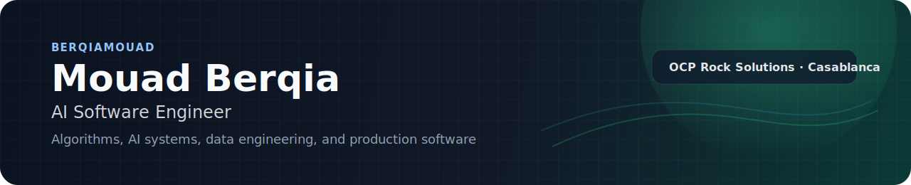

  

  AI Software Engineer at <strong>OCP Rock Solutions</strong> 
  Building agentic systems, full-stack products, and data-heavy software.

  <a href="https://www.linkedin.com/in/berqiamouad/">LinkedIn</a> ·
  <a href="https://codeforces.com/profile/MouadDidNotFail">Codeforces</a> ·
  <a href="https://ideas.repec.org/h/spr/lnichp/978-3-031-75329-9_42.html">Publication</a> ·
  <a href="mailto:berqiamouad@gmail.com">Email</a>

## About

I work on AI-powered software systems end to end: workflow automation, orchestration, backend services, frontend interfaces, deployment, and reliability.

Right now, my main focus is building production AI systems at **OCP Rock Solutions**. Before that, I worked on **AWS data pipelines and medallion architecture at BCG**, and on **document extraction / NLP systems at DiaaLand**.

My background is a mix of **software engineering**, **data science**, and **competitive programming**, which is why I naturally gravitate toward problems that need both strong implementation and strong reasoning.

## Highlights

- **AI Software Engineer** at OCP Rock Solutions since **September 2025**
- **Springer 2024** publication on LLM-generated plagiarism detection using NLP and ensemble learning
- **Kaggle Silver Medal** in *LLM - Detect AI Generated Text* with rank **165 / 4,358**
- **1st place** in the **ACM Moroccan Collegiate Programming Contest 2021**
- **1st place** in the **Moroccan National Programming Contest 2022**
- **Codeforces Expert** with max rating **1729**

## Selected Work

- [Neovim Setup](https://github.com/BerqiaMouad/Neovim-Setup) — developer tooling for faster competitive programming workflows inside Neovim
- [GTAV Self Driving Car](https://github.com/BerqiaMouad/GTAVSelfDrvingCarSupervisedAI) — computer vision and supervised learning in a simulation environment
- [Contest Creator & Solution Checker](https://github.com/BerqiaMouad/Contest_Creator_and_Solution_Checker) — CLI tooling for fetching samples and validating contest solutions locally
- [Competitive Programming](https://github.com/BerqiaMouad/competitive-programming) — contest archive and problem-solving work

## Interests

Algorithms, software engineering, AI engineering, data systems, developer tooling, quantitative research, and algo trading.
