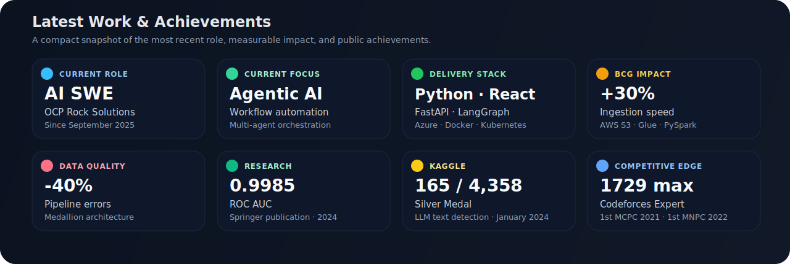

  

  
  
  
  

  AI Software Engineer at <strong>OCP Rock Solutions</strong> in Casablanca, focused on agentic systems, AI product engineering, and data-heavy software.

## Latest Work & Achievements

  

### Latest Work

- **September 2025 - Present**: AI Software Engineer at **OCP Rock Solutions**, building agentic AI systems for document-heavy and operations-heavy workflows using **Python, FastAPI, React/Vite, LangChain/LangGraph, Azure, Docker, and Kubernetes**.
- **January 2025 - July 2025**: Software Engineer Intern at **Boston Consulting Group**, where I built AWS ETL pipelines and a medallion-style data architecture for pricing data, improving ingestion speed by **30%** and reducing errors by **40%**.
- **July 2023 - September 2023**: Software Engineering Intern at **DiaaLand**, working on PDF extraction, section classification, and NER pipelines for document intelligence workflows.

### Latest Achievements

- **2024**: Co-authored a **Springer** publication on LLM-generated plagiarism detection using NLP and ensemble learning, with a reported **ROC AUC of 0.9985**.
- **January 2024**: Earned a **Kaggle Silver Medal** in *LLM - Detect AI Generated Text*, ranking **165 / 4,358** globally.
- **Current**: Reached **Codeforces Expert** with a maximum rating of **1729**.
- **October 2022**: Took **1st place** in the **Moroccan National Programming Contest**.
- **October 2021**: Took **1st place** in the **ACM Moroccan Collegiate Programming Contest**.

## Tech Stack

  

## GitHub Analytics

  
  

  
  

  

## Featured Repositories

  
  

  
  

## Interests

Algorithms, software engineering, AI engineering, data platforms, developer tooling, quantitative research, and algo trading.
